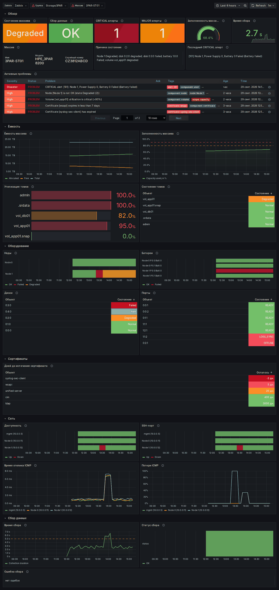

# Дашборд Grafana для HPE 3PAR

`hpe-3par-zabbix.json` — дашборд для хостов с шаблоном Zabbix «HPE SSMC StorageArray».
Данные берутся из Zabbix через плагин **Zabbix для Grafana**
(`alexanderzobnin-zabbix-app`).

*Снимок сделан на тестовом стенде с искусственными данными: в середине окна смоделированы
отказ ноды 1 и её недоступность по сети.*

## Что на дашборде

| Раздел | Панели |
|---|---|
| Обзор | состояние массива, статус сбора, число CRITICAL и MAJOR алертов, заполненность, время сбора; имя, модель и серийный номер; причина Degraded/Failed; текст последнего CRITICAL алерта; активные проблемы Zabbix по хосту |
| Ёмкость | общая, выделенная и свободная ёмкость; заполненность во времени с порогами 80/90 %; утилизация томов; состояние томов |
| Оборудование | история состояния нод и батарей; таблицы дисков и портов, проблемные сверху |
| Сертификаты | дней до истечения по каждому сертификату, пороги 7 и 30 дней |
| Сеть | история доступности и SSH-порта по адресам массива и нод; задержка и потери ICMP |
| Сбор данных | время опроса с порогом 5 с; история статуса; текст последней ошибки |

Пороги и цвета соответствуют макросам и value map шаблона.

## Требования

- Grafana 10.4 или новее (проверено на 11.6.0);
- плагин Zabbix для Grafana версии 4.x или новее. Проверено на 4.6.0, см. ниже;
- источник данных Zabbix в Grafana, подключённый к API Zabbix 7.0. Пользователю Zabbix
  нужны права на чтение группы хостов массивов.

## Импорт

1. Установите плагин: `grafana cli plugins install alexanderzobnin-zabbix-app`,
   перезапустите Grafana и включите приложение *Zabbix* в *Administration → Plugins*.
2. Создайте источник данных *Zabbix*: URL `https://<zabbix>/api_jsonrpc.php`, логин и пароль
   (или API-токен) пользователя Zabbix. Нажмите *Save & test*.
3. *Dashboards → New → Import* → загрузите `hpe-3par-zabbix.json`.
4. Вверху дашборда выберите источник данных, группу хостов и массив.

Дашборд не привязан к конкретному источнику данных: он выбирается переменной `Zabbix`,
поэтому файл можно импортировать в любую Grafana.

## Проверка и известные особенности

Дашборд проверен на стенде: Zabbix 7.0.31, шаблон из этого репозитория, Grafana 11.6.0,
плагин 4.6.0. Все панели получают данные, в светлой и тёмной теме.

Две особенности плагина **4.6.0** в связке с Zabbix 7.0.31. Сам дашборд на них не влияет,
обе относятся к версии плагина:

- *Save & test* выдаёт `Invalid parameter "/params": an array or object is expected`.
  Плагин вызывает `apiinfo.version` с пустой строкой вместо объекта, а новые сборки
  Zabbix 7.0 такое отклоняют. Графики при этом работают, но панели с текстом и переменные
  падают с ошибкой `Invalid version`;
- даже при исправном вызове при первом открытии дашборда панели с текстом («Массив»,
  «Причина состояния», «Последний CRITICAL алерт», «Ошибка сбора») могут показать ту же
  ошибку: плагин запрашивает версию Zabbix, не дожидаясь ответа. После обновления
  (кнопка *Refresh* или автообновление раз в минуту) всё загружается.

Используйте актуальную версию плагина и убедитесь, что *Save & test* проходит без ошибок.

## Изменение дашборда

Дашборд сгенерирован скриптом и сохранён как обычный JSON. Его можно править в интерфейсе
Grafana и экспортировать обратно. Тест `tests/test_grafana.py` проверяет, что каждый запрос
дашборда находит элемент данных шаблона. Если переименовать элемент в шаблоне, тест укажет,
какую панель нужно поправить.
